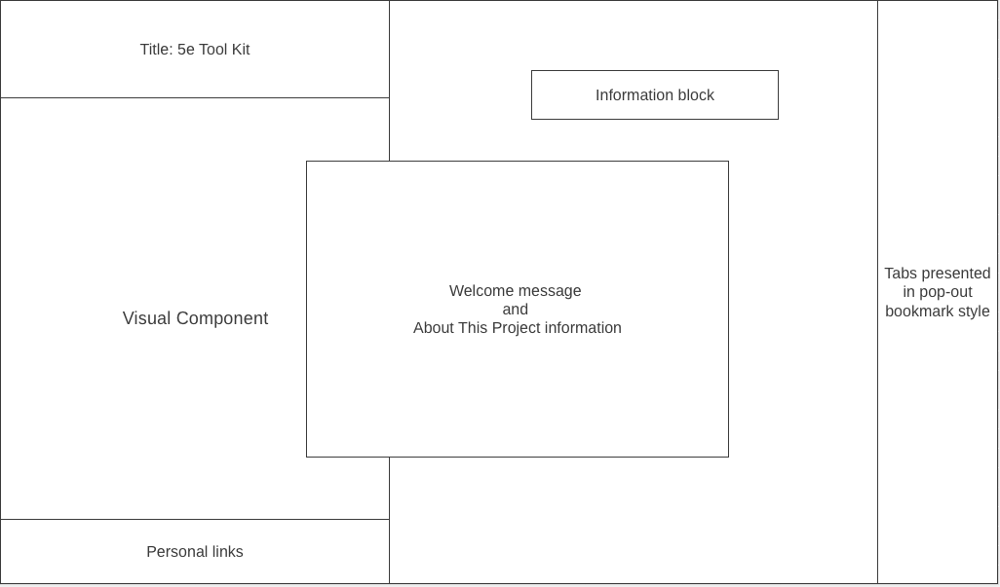

# 5e Player Toolkit

The [5e_player_toolkit](https://jtabor214.github.io/5e_player_toolkit/) is a data visualization containing information on the rules and statistics for the 5th edition of Dungeons & Dragons by Wizards of the Coast. This toolkit is designed to provide players with quick access to all relevant information found within the multiple modules spanning D&D's vast library. This includes information on topic such as playable Races and Classes, Background and Feat choices, Weapons and Armor, Magic Items, and more. The 5e Player Toolkit is designed to be intuative for all players, regardless of experience, by displaying the information in organized tabs leading to easy-to-digest snippets of information. The intentional organization of information on the application also follows the natural progression a player takes when designing a character.

## Functionality & MVPs:

### Within the 5e Player Toolkit:

* Users are able to choose from a selection of topics on the Navigation Bar by clicking on the appropriate tab. In response, the application will fetch the relevant information from an API and will present the proper information regarding the topic chosen.

* Tabs include: Races, Classes, Backgrounds, Feats, Equipment, Magic Items, and Spells

* Visual aspects that accompany certain information blocks

## Wireframe: 

## Technologies, Libraries, API's 

### All of the following technologies make up this project: 

* The Dungeons and Dragons OpenAPI: https://www.dnd5eapi.co/docs/. 
* Webpack to bundle and transpile the source JavaScript code.
* npm to manage project dependencies.
* HTML and CSS to structure and style the application.

## Implementation Timeline

* Friday Afternoon & Weekend: Complete the necessary set up requirements to get the project running--including the webpack. Create tabs and ensure fetching information is working appropriately. Ensure tabs work properly and that the applications functionality operates at its expected level.

* Monday: Ensure that fetched information is spaced and presented appropriately, close to its final position on the page.

* Tuesday: Finalize visualization ideas and the rendering of desired images. Begin animation processes for desired visuals. 

* Wednesday: Have all visualizations and styling finished. Tie up any remaining loose ends.

* Thursday: Deploy to GitHub.